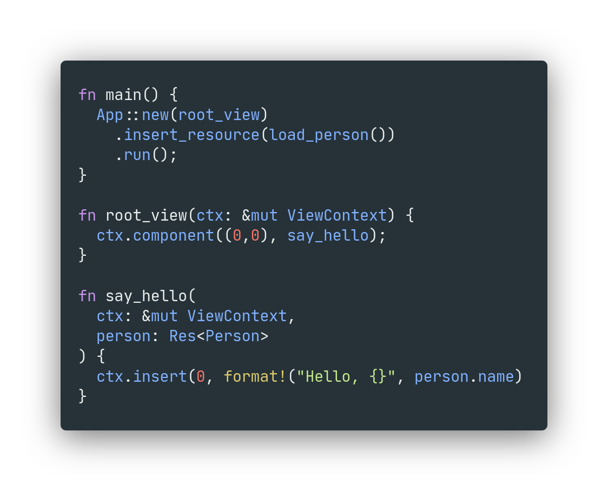

<div align="center">
  <h1>Arkham</h1>
  <p>
    <strong>An ergonomic TUI Framework</strong>
  </p>
  <p>
<!-- prettier-ignore-start -->

[](https://crates.io/crates/arkham)
[](https://docs.rs/arkham/0.2.1)

<br/>
[](https://github.com/5sigma/arkham/actions/workflows/docs.yml)
[](https://github.com/5sigma/arkham/actions/workflows/ci.yml)

[Read The Guide](https://5sigma.github.io/arkham)

<!-- prettier-ignore-end -->
  <p>
</div>



# Robust TUI foundation

Arkham attempts to give a firm foundation for building TUI Apps. 
It does not provide a set of widgets or components that can be used.
Instead, it tries to make the process of building terminal interfaces
easy enough that they aren't necessary.

- Keyboard handling
- Terminal modification
- Full screen terminal UIs with _alternate screen_ handling
- Full run loop and rendering engine
- Easy text formatting and styling
- Ergonomic component architecture
- Dependency injection

# Components are simple functions

```Rust
fn my_component(ctx &mut ViewContext) {
    ctx.insert((0,0), "Welcome");
}
```


# Easily handle text styling

```Rust
fn my_component(ctx &mut ViewContext) {
    ctx.insert(
        (0,0), 
        "Welcome"
            .to_runes()
            .bg(Color::Blue)
            .fg(Color::White),
    );
}
```


# Painless dependency injection

```Rust
fn my_component(ctx &mut ViewContext, user: Res<MyUser>) {
    ctx.insert(
        (0,0), 
        format!("Hello, {}", user.name),
    );
}
```

# Easy keyboard handling

```Rust
fn my_component(ctx &mut ViewContext, kb: Res<Keyboard>) {
    if kb.char() == Some('x') {
        ctx.insert(
            (0,0), 
            "X marks the spot"
        );
    }
}
```


